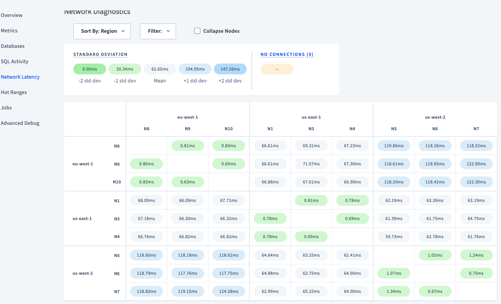

# CockroachDB : Multi-Region on AWS

This repo provides you with the ability to launch a Multi-region(topology) CockroachDB(Self-hosted) cluster on AWS using terraform. 

We are going to use the following tools to launch this cluster.

- [CockroachDB](https://www.cockroachlabs.com/docs/stable/frequently-asked-questions.html#what-is-cockroachdb) - Scalable & Resilient Distributed SQL Database that can survive anything.
- [AWS Cloud](https://aws.amazon.com/) -  Cloud Infrastucture to host a single region of CRDB
- [Terraform](https://www.terraform.io/intro) - To automate infrasturture build on AWS
- [PSSH](https://linux.die.net/man/1/pssh) - Parallel SSH tool to install and setup cockroachDB on AWS EC2 Instance
- [AWS Client VPN](https://aws.amazon.com/vpn/client-vpn/) - If you want to create a secure remote access to AWS Cloud from client machines

# Deployment Modes 
- You can choose to start cockroachDB in [secure](https://www.cockroachlabs.com/docs/v22.1/deploy-cockroachdb-on-aws) or [insecure](https://www.cockroachlabs.com/docs/v22.1/deploy-cockroachdb-on-aws-insecure) mode. 
- You can choose to run this out over the internet gateways or via VPN tunnel using AWS Client VPN. 

Note: Be aware that the load balancer you pick for `Secure mode` vs `Insecure` is important for connectivity. There are 2 types of load balancer available internal and internet-facing , `internal is for secure` and `internet-facing from insecure`.  

# Secure Cluster Topology

 We recommend using the AWS VPN Client and using the secure mode to add extra layers of security as you connect from your local system. The below architecture is for a multi-region CRDB cluster secure that the repo will help you build.

As per above architecture, we create :
- 3 Regions - US-East-1, US-West-2,EU-West-1
- 3 EC2 Instances per region
- 1 VPC per region with 3 Subnets
- 1 Network Load Balancer per region to distribute traffic within regions
- 3 Route53 records to distribute traffic across multiple regions
- Optional : AWS Client VPN for secure remote machine connection.

Note: 
- Both [Route53](https://aws.amazon.com/route53/) and [ELB](https://docs.aws.amazon.com/elasticloadbalancing/latest/userguide/what-is-load-balancing.html) are used to distribute the network traffic. ELB distributes traffic among Multiple Availability Zone but not to multiple Regions. Route53 can distribute traffic among multiple Regions.
- Change variables as needed in `variables.tf`

# Housekeeping : 
- Last Updated on 28/10/2022
- Terraform version : 1.3.1

# Pre-requsites:

The following pre-reqs need to be setup in advance for using this repo: 

- [Install Terraform](https://www.terraform.io/downloads) on local machine
- [Install and configure](https://docs.aws.amazon.com/cli/latest/userguide/getting-started-install.html) AWS CLI properly on local machine 
- [Create a SSH key-pair](https://docs.aws.amazon.com/AWSEC2/latest/UserGuide/create-key-pairs.html), so the launched AWS EC2 instances can be connected through SSH.
- [Install PSSH]( https://formulae.brew.sh/formula/pssh) on local system
- [Install AWS Client VPN](https://aws.amazon.com/vpn/client-vpn-download/) for Desktop on local machine

# Terraform Intro

Terraform enables users to plan, create, and manage infrastructure as code. There are various providers available to cloud providers such as AWS,GCP, Azure and more. These providers provide methods that terraform users to provision and manage infrastructure. 

## Essential Terraform Commands

- `terraform init` - initialize terraform script
- `terraform fmt` - format the terraform configuration files
- `terraform validate` - validate the terraform configuration
- `terraform apply` - create infrastructure from the configuration
- `terraform show` - inspect build
- `terraform destroy` - destroy the infrastructure 
- `terraform apply -var 'instance_name=yetanothername'` - change variables from command line

# Deploying a CockroachDB Cluster across Multi-Region 

This is divided into 7 parts
- Infrastucture build using terraform for multiple regions
  - Modules in Terraform
- VPC Peering, routing and security groups for multi-region
- Route53 and multiple Load Balancer connection
- Setting up a VPN Tunnel for secure remote access
- Installing and setting up CockroachDB
- Starting CockroachDB
- Workload Testing

Read the below documentation for detailed understanding. 
https://www.cockroachlabs.com/docs/v22.1/deploy-cockroachdb-on-aws.html

## 1. Infrastucture Build 

- [EC2 Instance](https://www.cockroachlabs.com/docs/v22.1/deploy-cockroachdb-on-aws.html#step-1-create-instances) 
- VPC 
- Subnets
- Internet gateway 
- Route tables
- [Security groups](https://www.cockroachlabs.com/docs/v22.1/deploy-cockroachdb-on-aws.html#step-2-configure-your-network)
- [Load Balancers](https://www.cockroachlabs.com/docs/v22.1/deploy-cockroachdb-on-aws.html#step-4-set-up-load-balancing) & Target groups

### Terraform Modules
As we create more complex infrastructure configurations, managing everything in a single `main.tf` file is not ideal. Terraform provides `Modules` to repurpose and reuse same configuration, its like packages we can call and use. To learn more about modules and its advantages check [here](https://developer.hashicorp.com/terraform/tutorials/modules/module).

- We have created a module called `infra_module` in `modules` folder. We will be referencing this module in the `main.tf` file. 
- Modify `providers.tf` file to configure each region where you want to create infrastructure.
- Make changes to `main.tf` file and modify `variables.tf` file in the main directory to change configuration.

### Build steps

1. To check the terraform build plan, run the following command.

        terraform plan

2. To build the infrastructure, run the following command.

        terraform apply

2. Run the below to get public IP address for EC2 Instances that were just created by terraform. We will need these ip address in next steps.

        terraform output           

3. Go to `AWS Cloud Console` and verify all the infrastructure is build as expected. 

Note: This should create about 20 resources per region once its done, so if 3 regions then 60 resources. 

## 2. VPC Peering, Routing, security groups and Route53 

#### Follow the steps [here](https://docs.aws.amazon.com/vpc/latest/peering/create-vpc-peering-connection.html#same-account-different-region) to create Peering Connection with VPCs in the same account and different Regions.  *Here are some key steps you have to do perform in order to ensure connectivity.*

- You will need the requester VPC ID and Accepter VPC ID. 
- Modify route tables in each VPCs 
   - `destination` = CIDR Block of other VPC
   - `target` = peering connection id
- Modify [security group](https://docs.aws.amazon.com/vpc/latest/peering/vpc-peering-security-groups.html)
  - Another new rules
  - Add destination of CIDR block of the peer VPC, type & port

## 3. Route53 and multiple Load Balancer connection

Follow the setps [here](https://docs.aws.amazon.com/Route53/latest/DeveloperGuide/routing-to-elb-load-balancer.html) to create routing to load balancers.Routing policies let you choose how Route 53 routes traffic to your resources. If you have multiple resources that perform the same operation, such as serve content for a website, choose a routing policy other than simple. Here's a brief comparison:

- Simple: Simple records use standard DNS functionality.

- Weighted: Weighted records let you specify what portion of traffic to send to each resource.

- Geolocation: Geolocation records let you route traffic to your resources based on the geographic location of your users.

- Latency: Latency records let you route traffic to resources in the AWS Region that provides the lowest latency. All resources must be in AWS Regions.

- IP-based: IP-based records let you route traffic to resources based on their IP-addresses that you know.

- Failover: Failover records let you route traffic to a resource when the resource is healthy or to a different resource when the first resource is unhealthy.

- Multivalue answer: Multivalue answer records let you configure Route 53 to return multiple values, such as IP addresses for your web servers, in response to DNS queries.

We used weighted routing in our architecture, but feel free to modify it for your need. 

## 4. Setting up a VPN Tunnel for secure remote access

Note : This step is only needed if you want to create a VPN Tunnel for secure access, if you do not want to then can continue with connecting through the Internet Gateway.

####  Follow the [Detailed steps here ](https://docs.aws.amazon.com/vpn/latest/clientvpn-admin/cvpn-getting-started.html) for AWS Client VPN Conncetion. The high level steps are as below for your understanding:

1. Generate server and client certificates and keys - [Detailed steps here](https://docs.aws.amazon.com/vpn/latest/clientvpn-admin/client-authentication.html#mutual)
2. Create a Client VPN endpoint, assocaite the target network you created in terraform and associate subnets.
3. Verify that your default security group and terraform created security groups are added.
4. Add Authorization rule for VPC
5. Download Client VPN end point configuration and setup a profile in client VPN.
5. Connect via the client VPN end point from local. 
6. Test connection by connecting via the internal IP for any EC2 Instance. 

## 5. Installing and setting up CockroachDB.

1. Go to `pssh_hosts_files.txt` and add Internal `host-ip-address` if connecting via AWS Client VPN as per your build that just completed. If connecting via internet gateway then add External `host-ip-address`.
2. Run the `setup.sh` script for AWS Time Sync Service and for installing CockroachDB. 

        `pssh -i -h ./Setup/pssh_hosts_files.txt -x "-oStrictHostKeyChecking=no -i add-your-key" -I < ./Setup/setup.sh`

3. Log into each node and test if setup ran as expected 

        `ssh -i add-ec2-key ec2-user@public-ip-of-host`

4. These step can vary depending on how you want to configure the cluster. You can setup the cluster either insecure or secure. Follow the [secure](https://www.cockroachlabs.com/docs/v22.1/deploy-cockroachdb-on-aws.html#step-5-generate-certificates 
) cluster creation steps. 

## 6. Starting CockroachDB

Follow the steps described [here](https://www.cockroachlabs.com/docs/v22.1/deploy-cockroachdb-on-aws.html#step-6-start-nodes). Below are some key things you need to do after you install cockroach binary on your local machine. 

`Note : if AWS VPN Client is used then add internal IPs, for connection through internet gateway use external IPs`

1. Modify and run the below command on `each node` of EC2 instance in each region. Make sure you modify the locality configuration per your regions and add the advertise address of your host node.

        cockroach start --certs-dir=certs --locality=country=us,region=us-east-1,zone=us-east-1a --store=node1 --advertise-addr=node 1:26257 --join=node1:26257,node2:26257,node3:26257 --cache=.25 --max-sql-memory=.25 --background
        
2. Initialize the cluster from `your local machine`. 

        cockroach init --certs-dir=certs --host=<internal ip address of any node on --join list>

3. Test if the cluster has started by running the below command from local machine

        cockroach node status --certs-dir=certs --host=<internal address of any node on --join list>
    
    This should show all the nodes that are running in the cluster. If 9 then 9 nodes. 

4. You can also, go to https://ip-any-node:8080 - This should take you a db console. Example below of 9 nodes across 3 regions.

Also, to log into the db console you will need a user. Its recommended to create a new user with password, as below. 

         
        (In Local) 
        cockroach sql --certs-dir=certs --host=<address of any node on --join list>
        
      
        (In SQL) 
        CREATE USER with_password WITH LOGIN PASSWORD 'add_password';

        show users;

    Note : Since we have a self signed certificate the browser may show that its insecure connection .To solve this in production, you can use a separate ui.crt/ui.key that is signed by some known cert authority (Verisign or whatever) -- if you do this, the DB Console will use that key/cert pair for its TLS while the CRDB nodes will still use the node certs signed by your self-signed cert.

## 7. Workload testing 

We can run the workload against a single aws load balancer in a region or we can run it against the route53 DNS that we created earliar. What you do just depends on what you want to test. In production, ideally you will use route53 and design your routing strategy per use cases or requirement. For this we need the IP address or DNS of the load balancer or Route53 DNS. So, feel free to test whats best for your need.

- For Application Load Balancers and Network Load Balancers, use the following command to find the load-balancer-id and DNS, alternatively you can get this info from details in console for load balancer:

        aws elbv2 describe-load-balancers --names load-balancer-name

- Initialize the tpcc workload

        cockroach workload init tpcc 'postgresql://root@ip-or-dns-name-of-network-load-balancer-or-route-53-DNS:26257/tpcc?sslmode=verify-full&sslrootcert=certs/ca.crt&sslcert=certs/client.root.crt&sslkey=certs/client.root.key'

- Run the workload against the aws load balancer

        cockroach workload run tpcc --duration=10m 'postgresql://root@ip-or-dns-name-of-network-load-balancer-or-route-53-DNS:26257/tpcc?sslmode=verify-full&sslrootcert=certs/ca.crt&sslcert=certs/client.root.crt&sslkey=certs/client.root.key'

 

You should now have a `running cluster` with test workload flowing into the DB. Go try some other things on this running cluster using these [tutorials/features](https://www.cockroachlabs.com/docs/stable/demo-replication-and-rebalancing.html) and have fun.

----

